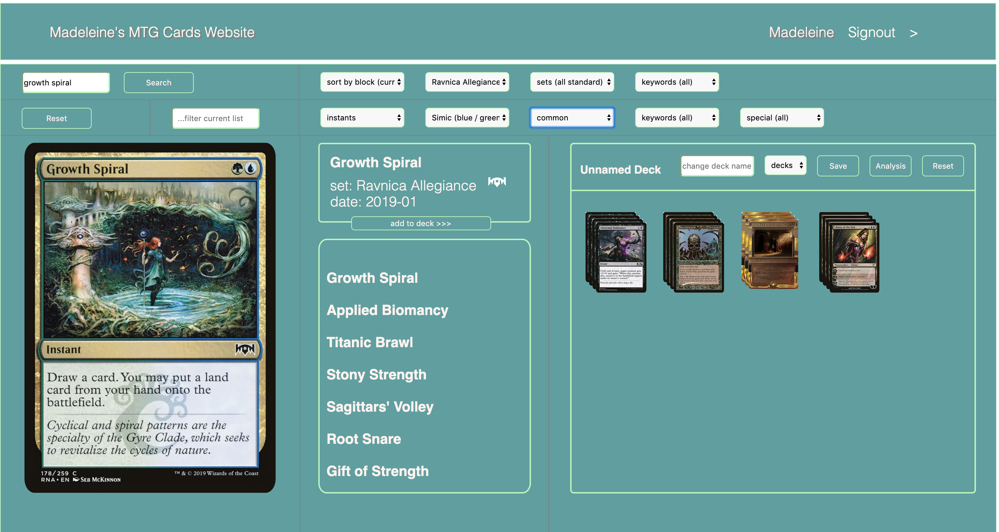

### Madeleine's MTG React-Redux Website Standard Edition

https://radiant-stream-78248.herokuapp.com/

Although appearing simple, this app was built with many technologies, including react, redux to manage state (including async middlewares for api calls), react-router, higher order components, good re-rendering functionality(local state is saved in browser), css modules for styling, node/express server with routing, mongo database, passport and jwt for authorization/user signin, modern es6 syntax, and heroku build & deployment with separate client and server. It utilizes a database of many thousands of Magic the Gathering cards from the Scryfall database. I have build downloaded the data and re-processed it according to my own usage. Currently the app is only available with the Standard cards (from the last 2 years) but I am actively working on making all of the cards available as well as implementing deck-building and saving options for the user accounts.

After signing in or signing up, the app will take you to a page where you can filter through the Magic cards and sort them in many different ways. Exploring the app might reveal another fun location :)

This is a current work in progress as of late-January 2019.

(update late January: I have implemented the beginnings of the deckbuilding logic. I have some more work to do before I'm going to deploy again as I want the deckbuilding to be a little more smooth than it is currently but it is coming along well :) )

